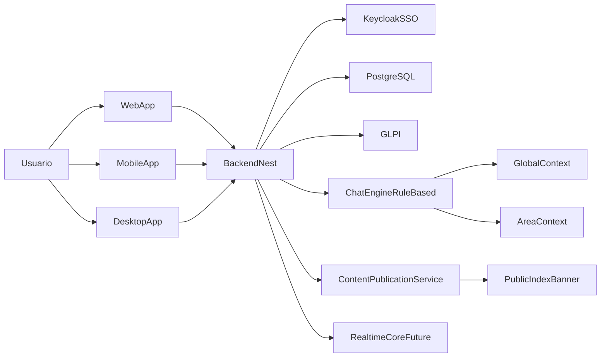

# Estrutura da Intranet Modular

## Objetivo

Estruturar uma Intranet corporativa modular para multiplas areas (RH, TI e outras), com autenticacao centralizada via Keycloak, exibicao controlada de conteudo publico/privado, integracao GLPI via SSO e atendimento por chat contextual, com suporte a Web, Mobile e Desktop.

## Premissas da Solucao

- SSO central: Keycloak como provedor de identidade.
- Chat MVP: abordagem rule-based/FAQ com evolucao para IA + RAG.
- Videoconferencia: nao habilitada no MVP, mas arquitetura preparada.

## Monorepo

- Gerenciador: npm Workspaces
- Linguagem: TypeScript 5.3 (todos os pacotes)
- Node: >= 18
- Qualidade: ESLint 8 + Prettier 3 + Husky + lint-staged

## Estrutura de Pacotes

- `packages/backend`: API NestJS (dominio, auth, integracoes, regras de negocio)
- `packages/web`: aplicacao web responsiva (publico/privado)
- `packages/mobile`: app mobile (Expo) com foco operacional
- `packages/desktop`: app desktop (Tauri + React)
- `packages/shared`: contratos, tipos e utilitarios compartilhados

## Pacotes

### `packages/backend` (API)

- Framework: NestJS 10 (Express)
- ORM: Prisma 5
- Banco: PostgreSQL
- Autenticacao: Passport JWT + passport-local + bcrypt
- Agendamento: `@nestjs/schedule`
- Upload: Multer
- Documentos: docx + Puppeteer
- OCR: Tesseract.js
- Imagem: Sharp
- E-mail: Nodemailer
- CSV/XLSX: csv-parse + xlsx
- HTTP: Axios
- Scraping: Cheerio
- PDF parsing: pdf-parse

Modulos principais:
- `auth` (SSO Keycloak + RBAC)
- `users` (usuarios e identidade interna)
- `org` (areas e organizacao)
- `modules`/`area-modules` (modularizacao por area)
- `content` (conteudo publico/privado e banners)
- `glpi` (integracao de chamados e SSO delegado)
- `chat` (atendimento contextual rule-based)
- `notifications` (avisos e comunicacao)
- `files` (upload e documentos)
- `integration` (jobs e rotinas agendadas)
- `realtime` (base para videoconferencia futura)

### Modelo de dominio (Prisma)

Entidades centrais previstas:
- `User`, `Role`, `Permission`, `Area`, `Membership`
- `Module`, `ModuleAreaConfig`, `FeatureToggle`
- `PublicContent`, `Banner`, `PublicationRule`
- `ChatIntent`, `ChatRule`, `ChatContext`, `ChatSession`, `ChatMessage`
- `GlpiTicketLink`, `AuditLog`
- `MeetingRoom`, `MeetingParticipant`, `MeetingAudit` (futuro realtime)

### `packages/web`

- React 18 + Vite 5 + Tailwind CSS 3
- React Router DOM 6
- TanStack React Query 5
- Zustand 4
- React Hook Form 7

### `packages/mobile`

- Expo 50 + React Native 0.73
- Expo Router 3
- React Navigation 6
- TanStack React Query 5
- Zustand 4
- expo-secure-store
- Axios

### `packages/desktop`

- Tauri 1 (Rust)
- React 18 + Vite 5 + Tailwind CSS 3
- React Router DOM 6
- TanStack Query 5 + Zustand 4

### `packages/shared`

- Tipos TypeScript compartilhados
- Utilitarios e contratos comuns
- Schemas de validacao e helpers de autorizacao
- Cliente HTTP padrao para todos os apps

## Fluxos Funcionais

### Publico x Privado configuravel

- Cada modulo inicia como privado por padrao.
- Areas (ex.: RH, TI) podem publicar blocos para a Index publica via regras.
- Conteudo publico segue fluxo de governanca: `DRAFT -> APPROVED -> PUBLISHED`.

### SSO Keycloak + RBAC

- Backend valida JWT/OIDC emitido pelo Keycloak.
- Roles/grupos vindos do Keycloak sao mapeados para papeis internos.
- Politicas por area controlam acesso a rotas, modulos e acoes sensiveis.

### Integracao GLPI

- Endpoint de redirecionamento SSO delegado para GLPI.
- Deep-link seguro para abertura/consulta de chamado.
- Vinculo de chamados com usuario/area e auditoria de acesso.

### Atendimento via Chat (MVP)

- Motor rule-based por intencao (`ChatIntent`) e regras por area (`ChatRule`).
- Resolucao em camadas:
  - contexto global da intranet
  - contexto da area
  - fallback para atendimento humano/GLPI
- Base de conhecimento versionada por area (FAQ, politicas, links).

### Evolucao do Chat (Fase 2)

- Mesma interface de servico para plugar provedor IA + RAG.
- Reuso de trilhas de auditoria, contexto e historico do MVP.

## Infraestrutura local (containers)

- PostgreSQL: `localhost:11001`
- Keycloak: `localhost:11002`
- Backend: `localhost:11003`

## Qualidade, Seguranca e Operacao

- ESLint + Prettier + Husky + lint-staged no monorepo.
- Controle de acesso por claims e politicas por area.
- Logs estruturados e trilha de auditoria para acoes sensiveis.
- Docker Compose para ambiente local (Postgres, Keycloak, backend).
- CI com lint, test e build por pacote.

## Roadmap de Entrega

1. Fundacao do monorepo + CI + ambientes.
2. Auth/SSO Keycloak + RBAC + modelo organizacional.
3. Conteudo e exposicao publico/privado (Index + banners).
4. Integracao GLPI via SSO.
5. Chat rule-based com contexto global e por area.
6. Consolidacao dos clientes web/mobile/desktop.
7. Hardening, observabilidade e preparacao realtime.

## Arquitetura (alto nivel)

